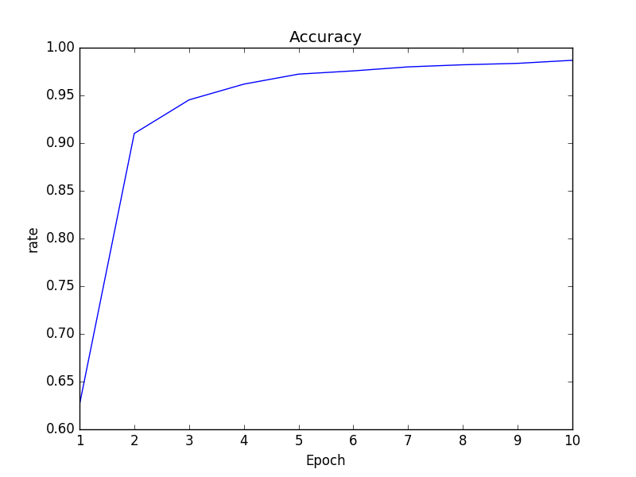
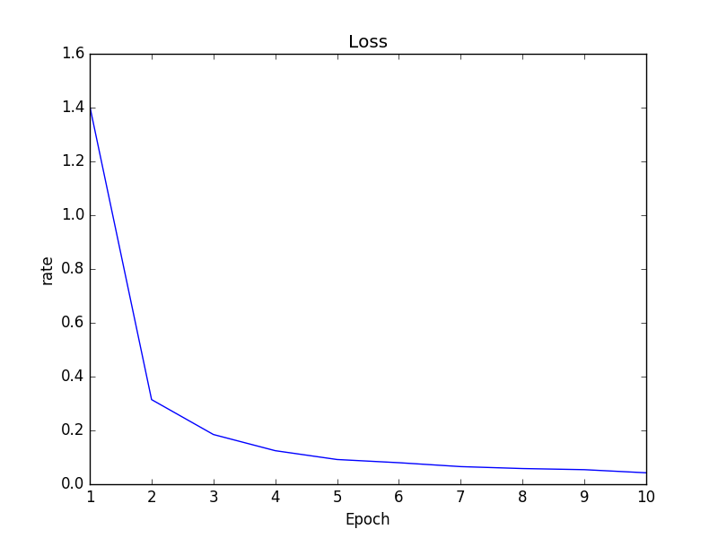
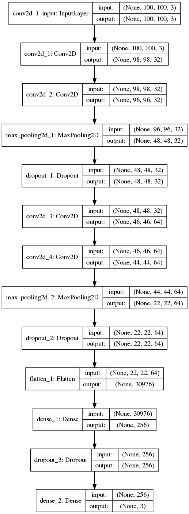

Introduction
=======
In this project, I make a face_recognition demo based on Keras/Tensorflow. The database I built up based on 62 persons in my class. Each person I collected 1000 face pictures which size 128x128 pixls. Training in CNN, I get a face recognition model of these 62 persons.  
* Accurancy and Loss are show below:
  

* Structure of CNN I used:  

